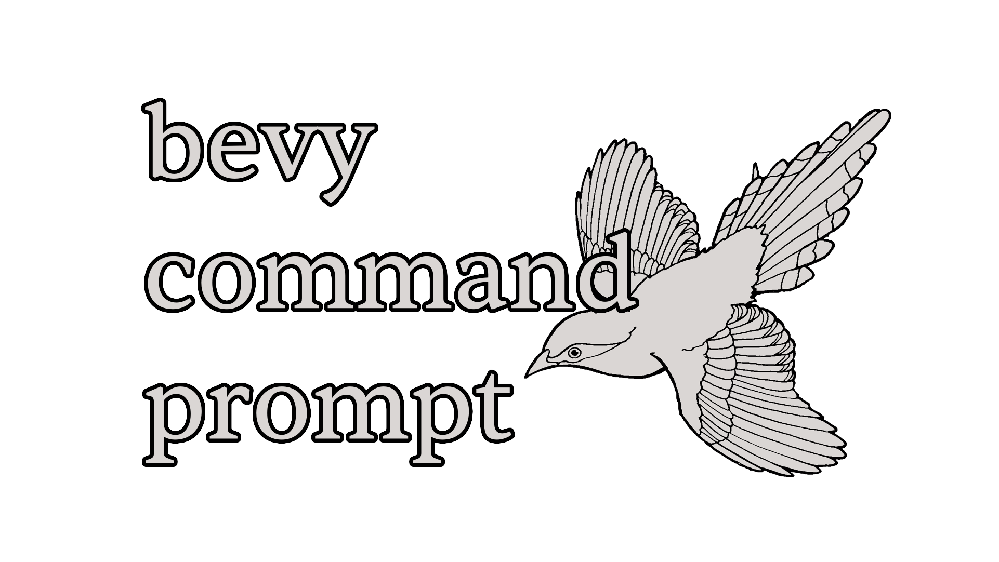
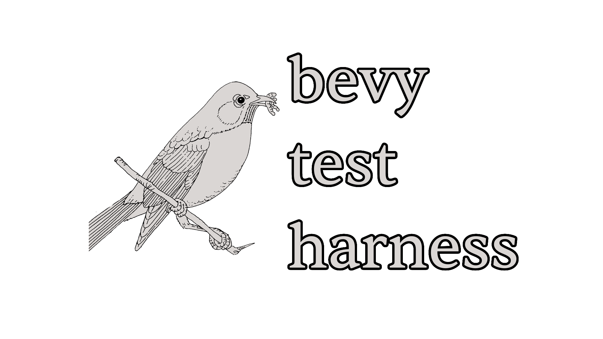

    </img>

Monorepo for _qproj_. This includes utilities, templates, and more for my [bevy](https://bevy.org) game projects.

_This continues the work started [here.](https://github.com/ada-x64/qproj_OLD)_

## Crates

    
    
    

## Compatility

| branch/tag | bevy |
| ---------- | ---- |
| main       | 0.18 |
